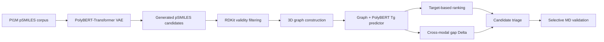

# PolyMolStudio

[](https://doi.org/10.5281/zenodo.21485082)
[](LICENSE)

**PolyMolStudio** is an open-source framework for polymer glass-transition temperature (T<sub>g</sub>) design. It connects pSMILES-based candidate generation, multimodal T<sub>g</sub> prediction, candidate triage, and selective molecular-dynamics (MD) validation in a single research workflow.

This repository accompanies the manuscript:

> **A Multimodal Screening and Validation Framework for Polymer Glass-Transition Temperature Design**
>
> Tianyu Huang, Wenzhu Bi, Xi Zhang, Xiao Gui, Zheyuan Jiang, and Menghao Yang
>
> 

## Overview

The framework is designed for **high-throughput candidate prioritization**, not as a replacement for experimental measurements or physics-based validation.



The main components are:

1. **Polymer generation** — a VAE with a PolyBERT encoder and autoregressive Transformer decoder learns a continuous latent space from PI1M pSMILES.
2. **Multimodal T<sub>g</sub> prediction** — geometry-enhanced molecular graphs and PolyBERT sequence representations are fused through bidirectional cross-attention.
3. **Candidate triage** — the absolute prediction gap between the multimodal and graph-only branches, Δ, is available as a lightweight representation-consistency diagnostic.
4. **Physics-based assessment** — selected candidates can be evaluated using the included RadonPy/LAMMPS cooling workflow and density–temperature fitting scripts.

In the codebase, the paper's **CrossAttentionPolyGeoGAT** corresponds to `GeoGATModel(use_polybert=True)`, while **PolyGeoGAT** corresponds to `GeoGATModel(use_polybert=False)`.

## Research highlights

| Evaluation | Result reported in the manuscript |
|---|---:|
| Raw generated candidate library | 2,000,000 pSMILES |
| Chemical validity | 90.03% |
| Uniqueness | 99.76% |
| Novelty relative to the training set | 99.99% |
| Multimodal predictor MAE | 24.27 K |
| Multimodal predictor RMSE | 35.12 K |
| Multimodal predictor R² | 0.903 |
| Repeated-split multimodal MAE | 24.35 ± 0.89 K over 10 splits |
| MD-evaluated generated candidates | 21 |

The multimodal model outperformed the graph-only model in all 10 repeated data splits. However, performance depends on structural similarity to the training set: the reported MAE increased from 19.3 K for high-similarity test polymers to 40.0 K for low-similarity polymers.

### Interpretation and limitations

- The predictor should be used for **screening and ranking**, not as an experimental T<sub>g</sub> substitute.
- Δ measures agreement between two model views. It is **not** a calibrated uncertainty estimate, an out-of-distribution detector, or a guaranteed proxy for MD error.
- Prediction accuracy decreases for structures that are dissimilar to the training set.
- The unconditional VAE under-represents the high-T<sub>g</sub> tail. T<sub>g</sub>-conditioned fine-tuning enriches candidates above 500 K but does not provide reliable direct targeting of very high T<sub>g</sub> values.
- The MD study contains 21 generated candidates and is intended as selective physics-based assessment rather than exhaustive validation.
- MD-derived T<sub>g</sub> values depend on the cooling protocol, simulation size, force field, and fitting procedure.

## Repository structure

| Path | Description |
|---|---|
| `models/generator/` | VAE implementations, including v4 base/medium/premium variants |
| `models/predictor/GeoGATModel.py` | Geometry-enhanced graph model with optional PolyBERT cross-attention |
| `train/train_generator/` | Generator pretraining and T<sub>g</sub> fine-tuning scripts |
| `train/train_predictor.py` | Graph-only or multimodal predictor training |
| `sample/` | Unconditional and T<sub>g</sub>-conditioned sampling scripts |
| `predict/` | Single-model and ensemble predictor inference |
| `design/generate_and_score.py` | End-to-end generation → graph conversion → T<sub>g</sub> scoring pipeline |
| `utils/PSMILES_to_graph.py` | pSMILES-to-3D-graph conversion with RDKit |
| `MolecularDynamics/MDprotocol/` | RadonPy workflow, density–temperature data, fitting, and uncertainty analyses |
| `demo/analysis_outputs/` | Analysis outputs used to inspect prediction, similarity, and triage behavior |
| `polybert/` | Local PolyBERT tokenizer and model files |
| `CITATION.cff` | Machine-readable software citation metadata |

Legacy v1–v3 generator implementations and reinforcement-learning experiments are retained for development history. The publication-facing workflow uses the **v4 generator** and the **GeoGAT multimodal predictor**.

## Installation

Clone the repository and run all commands from its root directory:

```bash
git clone https://github.com/geinitangwanle/PolyMolStudio.git
cd PolyMolStudio
conda create -n polymolstudio python=3.8
conda activate polymolstudio
```

Install a hardware-compatible build of PyTorch and PyTorch Geometric first, followed by the remaining scientific Python dependencies. The principal dependencies are:

- PyTorch and PyTorch Geometric
- Transformers
- RDKit
- pandas and NumPy
- SciPy and scikit-learn
- tqdm and Matplotlib

The workflow was tested in the following local environment:

| Package | Tested version |
|---|---:|
| Python | 3.8 |
| PyTorch | 2.4.1 |
| PyTorch Geometric | 2.6.1 |
| Transformers | 4.46.3 |
| RDKit | 2022.09.5 |
| pandas | 2.0.3 |
| NumPy | 1.24.4 |
| scikit-learn | 1.3.2 |
| SciPy | 1.10.1 |

> **Environment note:** a locked `environment.yml` or `requirements.txt` is not currently included. PyTorch Geometric binary dependencies must be installed for the selected PyTorch, CUDA, and operating-system combination.

The local PolyBERT files are provided under `./polybert`. Compatible Hugging Face model identifiers can also be used by scripts that accept `--polybert-dir`.

## Data, model files, and archived outputs

The repository expects the following local layout:

```text
PolyMolStudio/
├── data/
│   └── raw/
│       ├── PI1M_v2_psmiles.csv
│       └── PSMILES_Tg_only.csv
├── checkpoints/
│   ├── pretrain_modelv4.pt
│   ├── finetune_tg_modelv4.pt
│   ├── multi-predictor.pt
│   └── graph-predictor.pt
└── polybert/
```

| Resource | Purpose | Availability |
|---|---|---|
| PI1M | Unsupervised VAE pretraining corpus | See the PI1M reference below |
| PolyMetriX T<sub>g</sub> data | Supervised predictor training and evaluation | See the PolyMetriX reference below |
| Raw VAE-generated candidate library | 2,000,000 generated candidates with validity, uniqueness, and novelty annotations | [Figshare DOI: 10.6084/m9.figshare.31821124](https://doi.org/10.6084/m9.figshare.31821124) |
| Source-code archive | Versioned software release | [Zenodo DOI: 10.5281/zenodo.21485082](https://doi.org/10.5281/zenodo.21485082) |
| MD validation data | Density–temperature data for 21 candidates | `MolecularDynamics/MDprotocol/` |

Training datasets and `.pt` checkpoints are excluded by `.gitignore`; they must be prepared, trained, or supplied locally before running the corresponding commands. The Zenodo record is the archived software release and should not be assumed to contain model checkpoints unless a specific release explicitly lists them.

## Quick start: generate and score candidates

The following command was smoke-tested from the repository root using the v4 base generator and the multimodal predictor:

```bash
python design/generate_and_score.py \
  --gen-checkpoint checkpoints/pretrain_modelv4.pt \
  --polybert-dir ./polybert \
  --model-size base \
  --num-samples 20 \
  --batch-size 20 \
  --max-len 256 \
  --temperature 0.7 \
  --top-k 50 \
  --seed 42 \
  --predictor-ckpt checkpoints/multi-predictor.pt \
  --predict-batch-size 32 \
  --num-workers 0 \
  --predict-device cpu \
  --output-dir design_outputs \
  --samples-file generated_samples.csv \
  --scored-file generated_scored.csv
```

Outputs:

- `design_outputs/generated_samples.csv` — generated pSMILES strings
- `design_outputs/graphs/` — graph files created for valid generated structures
- `design_outputs/generated_scored.csv` — generated structures merged with predicted T<sub>g</sub> values

Important execution constraints:

- Run the command from the repository root because existing checkpoints may store `./polybert` as a relative tokenizer/model path.
- Keep `--max-len 256` when using checkpoints trained with 256-position embeddings; changing it can cause checkpoint shape mismatches.
- The predictor defaults to CPU because some PyTorch Geometric sparse operations have limited MPS support. Use `--predict-device cuda` when a compatible CUDA setup is available.
- `--top-p` follows the standard nucleus-sampling convention and should normally be in `(0, 1]`. Omit it to disable top-p filtering.

## Generation

### Unconditional v4 sampling

```bash
python utils/unified_cli.py sample \
  --version v4 \
  --mode uncond -- \
  --checkpoint checkpoints/pretrain_modelv4.pt \
  --polybert-dir ./polybert \
  --num-samples 512 \
  --batch-size 128 \
  --max-len 256 \
  --temperature 0.7 \
  --top-k 50 \
  --seed 42 \
  --output-dir outputs_pretrain
```

To compute novelty relative to a reference corpus, add:

```bash
--data-csv data/raw/PI1M_v2_psmiles.csv --data-col PSMILES
```

### Exploratory T<sub>g</sub>-conditioned sampling

```bash
python utils/unified_cli.py sample \
  --version v4 \
  --mode tg -- \
  --checkpoint checkpoints/finetune_tg_modelv4.pt \
  --polybert-dir ./polybert \
  --data-csv data/raw/PSMILES_Tg_only.csv \
  --target-tg 500 \
  --num-per-target 128 \
  --max-len 256 \
  --seed 42
```

Conditioned generation is included for experimentation, but broad unconditional sampling followed by predictor-based screening is the primary strategy used in the study.

## T<sub>g</sub> prediction

Predict T<sub>g</sub> for a CSV containing a pSMILES column:

```bash
python predict/predict.py \
  --ckpt_path checkpoints/multi-predictor.pt \
  --csv_path input.csv \
  --psmiles_col PSMILES \
  --save_dir pred_graphs \
  --batch_size 32 \
  --device cpu \
  --seed 42 \
  --out_csv predictions.csv
```

The inference script constructs 3D graph features, loads the checkpoint configuration, runs the graph-only or multimodal model, and writes a `pred` column in kelvin.

## Training

### Pretrain the v4 generator

```bash
python utils/unified_cli.py train \
  --version v4 \
  --mode pretrain -- \
  --csv data/raw/PI1M_v2_psmiles.csv \
  --col PSMILES \
  --polybert-dir ./polybert \
  --model-size base \
  --output checkpoints/pretrain_modelv4.pt
```

### Fine-tune the v4 generator with T<sub>g</sub> labels

```bash
python utils/unified_cli.py train \
  --version v4 \
  --mode finetune -- \
  --csv data/raw/PSMILES_Tg_only.csv \
  --col-smiles PSMILES \
  --col-tg Tg \
  --pretrained checkpoints/pretrain_modelv4.pt \
  --polybert-dir ./polybert \
  --model-size base \
  --output checkpoints/finetune_tg_modelv4.pt
```

### Train the T<sub>g</sub> predictor

First convert labeled pSMILES into graph files and a manifest:

```bash
python - <<'PY'
from utils.PSMILES_to_graph import convert_csv_to_graphs

convert_csv_to_graphs(
    csv_path="data/raw/PSMILES_Tg_only.csv",
    label_col="Tg",
    PSMILES_col="PSMILES",
    save_dir="data/graphs/tg",
)
PY
```

Then train the multimodal model:

```bash
python train/train_predictor.py \
  --data_path data/graphs/tg/manifest.csv \
  --root_dir . \
  --use_polybert \
  --polybert_dir ./polybert \
  --split_seed 42 \
  --model_seed 42 \
  --device auto \
  --run_name crossattention_tg
```

Omit `--use_polybert` to train the graph-only ablation. Training logs are written under `logs/`, and checkpoints are written to timestamped subdirectories under `checkpoints/`.

## Molecular-dynamics validation

`MolecularDynamics/MDprotocol/` contains:

- the RadonPy-based polymer construction, equilibration, and cooling workflow;
- density–temperature data for 21 generated candidates;
- bilinear T<sub>g</sub> fitting outputs;
- fitting-window sensitivity analysis;
- nonlinear-fit robustness analysis.

The main workflow is configured in `MolecularDynamics/MDprotocol/MD_Tg_1.py`. Its chemical system, compute resources, temperature schedule, and working directories are defined as script-level parameters and must be reviewed before execution. The workflow requires external scientific software, including RadonPy, Psi4, and LAMMPS, and is substantially more computationally demanding than generation or ML inference.

MD-estimated T<sub>g</sub> values should be interpreted as protocol-dependent physical references. They are not absolute ground truth for evaluating individual ML predictions.

## Reproducibility notes

- Core training and inference scripts expose fixed random seeds; the paper used seed 42 for the primary data split.
- Predictor training supports separate `--split_seed` and `--model_seed` values.
- The reported repeated-split comparison retrained both graph-only and multimodal models across 10 data partitions.
- Label standardization statistics are computed from the training set only.
- Generator and predictor outputs depend on the exact checkpoint, dependency versions, hardware backend, and sampling parameters.
- Do not load untrusted PyTorch checkpoint files. `torch.load` may deserialize executable Python objects.

## Citation

If you use PolyMolStudio, please cite the archived software release:

```bibtex
@software{huang_polymolstudio_2026,
  author = {Huang, Tianyu},
  title = {PolyMolStudio},
  year = {2026},
  doi = {10.5281/zenodo.21485082},
  url = {https://doi.org/10.5281/zenodo.21485082}
}
```

Please also cite the associated article once its final bibliographic metadata and DOI are available:

> Huang, T.; Bi, W.; Zhang, X.; Gui, X.; Jiang, Z.; Yang, M. **A Multimodal Screening and Validation Framework for Polymer Glass-Transition Temperature Design.** *Digital Discovery*.

Machine-readable citation metadata are provided in [`CITATION.cff`](CITATION.cff).

## Related resources

1. Kuenneth, C.; Ramprasad, R. **polyBERT: a chemical language model to enable fully machine-driven ultrafast polymer informatics.** *Nature Communications* **2023**, *14*, 4099. [DOI: 10.1038/s41467-023-39868-6](https://doi.org/10.1038/s41467-023-39868-6).
2. Kunchapu, S.; Jablonka, K. M. **PolyMetriX: an ecosystem for digital polymer chemistry.** *npj Computational Materials* **2025**, *11*, 312. [DOI: 10.1038/s41524-025-01823-y](https://doi.org/10.1038/s41524-025-01823-y).
3. Ma, R.; Luo, T. **PI1M: A Benchmark Database for Polymer Informatics.** *Journal of Chemical Information and Modeling* **2020**, *60*, 4684–4690. [DOI: 10.1021/acs.jcim.0c00726](https://doi.org/10.1021/acs.jcim.0c00726).
4. Hayashi, Y.; Shiomi, J.; Morikawa, J.; Yoshida, R. **RadonPy: automated physical property calculation using all-atom classical molecular dynamics simulations for polymer informatics.** *npj Computational Materials* **2022**, *8*, 222. [DOI: 10.1038/s41524-022-00906-4](https://doi.org/10.1038/s41524-022-00906-4).

## License

PolyMolStudio is released under the [MIT License](LICENSE).

<details>
<summary>中文简介</summary>

PolyMolStudio 是一个面向聚合物玻璃化转变温度设计的开源计算框架，包含基于 pSMILES 的聚合物候选生成、多模态 T<sub>g</sub> 预测、候选筛选以及选择性分子动力学验证。仓库对应论文已获 *Digital Discovery* “小修后接收”决定，正式论文 DOI 将在出版后补充。

使用模型结果时应注意：预测器适合高通量筛选和排序，但不能替代实验测量；跨模态预测差值 Δ 仅用于辅助判断两种表征的一致性，并不是经过校准的不确定性指标或误差保证。

</details>
